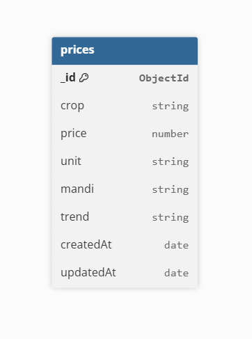

# 🌾 MandiMitra

### *AI-Powered Mandi Price Forecaster for Mountain Farmers*

> Empowering village-level coordinators in Uttarakhand to make smarter selling decisions using live government mandi data and AI-generated advisories.

---

## 🚩 The Problem

Small-hold farmers in Kedarnath Valley harvest crops without knowing mandi prices.
By the time they reach Rudraprayag or Haldwani, they must accept whatever the middleman quotes — with no data, no forecast, no leverage.

---

## 💡 The Solution

**MandiMitra** fetches live mandi prices, visualizes 2-week trends, and delivers an AI advisory — *hold, sell, or reroute* — in plain Hindi/English, shareable instantly via WhatsApp.

---

## ✨ Features

| # | Feature | Description |
|---|---|---|
| 1 | 📊 Live Price Lookup | Real-time mandi prices via Agmarknet / data.gov.in API |
| 2 | 📈 Trend Chart | 2-week price trend visualized with Recharts |
| 3 | 🤖 AI Advisory | Claude API generates hold/sell/reroute recommendation |
| 4 | 🌾 Crop & Mandi Selector | Dropdowns for crop type and nearest mandi |
| 5 | 📲 WhatsApp Card Export | One-tap shareable advisory card for farmers |

---

## 🛠️ Tech Stack

| Layer | Tool |
|---|---|
| Frontend | React 18 + Vite |
| Styling | Tailwind CSS |
| Charts | Recharts |
| AI API | Anthropic Claude API (Haiku) |
| Live Data | Agmarknet / data.gov.in |
| Backend | Express.js (Node) |
| Database | MongoDB + Mongoose |
| Deployment | Vercel (Frontend) + Render (Backend) |

---

## 📁 Project Structure

```
backend/
├── config/
│   └── db.js              # Mongoose connection helper
├── models/
│   └── Price.js           # Mongoose schema/model for mandi prices
├── docs/
│   └── schema-diagram.png
├── .env.example
├── server.js
└── package.json
```

---

## 🗄️ Database

**Choice: MongoDB + Mongoose**

We chose MongoDB over a relational database because mandi price records are simple,
self-contained documents (crop, price, unit, mandi, trend) with no need for joins
across tables at this stage. Mongoose gives us schema validation (required fields,
number ranges, defaults) on top of MongoDB's flexibility, which matters because this
data will later be extended with fields like AI advisory text or forecast metadata
without needing a migration. MongoDB Atlas's free tier also made it the fastest path
to a hosted database for this project's timeline.

### Schema Diagram



There is currently a single collection, **`prices`**, modeled by `models/Price.js`.
Each document represents one crop's price at one mandi. See the diagram above for
fields, types, and constraints.

### Set up the database

1. Create a free MongoDB Atlas cluster at [mongodb.com/atlas](https://www.mongodb.com/atlas) (or run MongoDB locally).
2. Get your connection string (Atlas: **Connect → Drivers**, copy the `mongodb+srv://...` URI).
3. In the `backend/` folder, copy the example env file:
   ```
   cp .env.example .env
   ```
4. Open `.env` and set:
   ```
   PORT=5000
   MONGO_URI=mongodb+srv://<username>:<password>@<cluster-url>/mandimitra?retryWrites=true&w=majority
   ```
   (For a local MongoDB instead: `MONGO_URI=mongodb://localhost:27017/mandimitra`)
5. **Never commit `.env`** — it's already listed in `.gitignore`. Only `.env.example` (with placeholder values) is committed.

## How to Run Backend Locally

1. Go to backend folder: `cd backend`
2. Install dependencies: `npm install`
3. Set up your `.env` as described above
4. Start server: `npm run dev`
5. Server runs at http://localhost:5000 and connects to MongoDB on startup
   (you'll see `✅ MongoDB connected` in the console)

### API Endpoints
- GET /api/prices — list all prices, newest first
- GET /api/prices/:id — get one price by MongoDB `_id`
- POST /api/prices — create a price (`crop`, `price`, `mandi` required; `unit`, `trend` optional)
- PUT /api/prices/:id — update a price by `_id`
- DELETE /api/prices/:id — delete a price by `_id`
- GET /api/search?crop= — search prices by crop name (case-insensitive)